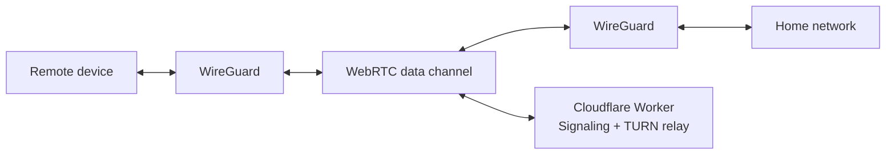

# riftgate

A WireGuard VPN tunnel over WebRTC. Access your home network from anywhere without exposing your public IP or renting a VPS.

## How it works

riftgate connects two peers through a WireGuard tunnel, using WebRTC data channels as the transport layer. A Cloudflare Worker handles signaling and acts as a TURN relay fallback — all on the free tier.



- **Direct connection**: ICE/STUN punches through NAT when possible — low latency, no relay.
- **Relayed connection**: When direct fails (symmetric NAT), traffic routes through a TURN relay on Cloudflare Durable Objects. The relay only sees opaque encrypted blobs.

## Goals

- Zero exposed ports on the home network
- No VPS required — runs entirely on Cloudflare's free tier
- Single static binary for Linux, Android app via gomobile
- WireGuard encryption end-to-end, with DTLS as an additional layer

## Status

Under active development. See [ARCHITECTURE.md](ARCHITECTURE.md) for the full design.

## Building

```bash
go build -o riftgate ./cmd/riftgate
```

## License

TBD
