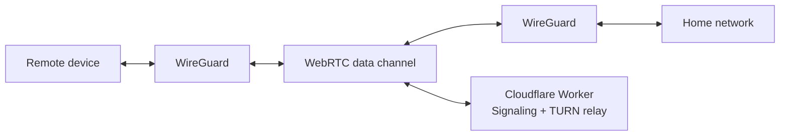

<p align="center">
  
</p>

# bamgate

A WireGuard VPN tunnel over WebRTC. Access your home network from anywhere without exposing your public IP or renting a VPS.

## How it works

bamgate connects two peers through a WireGuard tunnel, using WebRTC data channels as the transport layer. A Cloudflare Worker handles signaling and acts as a TURN relay fallback — all on the free tier.



- **Direct connection**: ICE/STUN punches through NAT when possible — low latency, no relay.
- **Relayed connection**: When direct fails (symmetric NAT), traffic routes through a TURN relay on Cloudflare Durable Objects. The relay only sees opaque encrypted blobs.

## Install

### Linux and macOS

```bash
curl -fsSL https://raw.githubusercontent.com/bamgate/bamgate/main/install.sh | sh
```

This installs the `bamgate` binary to `/usr/local/bin`. Sudo is requested automatically if needed.

To install a specific version:

```bash
BAMGATE_VERSION=0.5.0 curl -fsSL https://raw.githubusercontent.com/bamgate/bamgate/main/install.sh | sh
```

### Build from source

```bash
go build -o bamgate ./cmd/bamgate
sudo cp bamgate /usr/local/bin/
```

## Quick start

### First device (deploys the Cloudflare Worker)

```bash
sudo bamgate setup
```

This walks you through deploying the signaling server, generating WireGuard keys, and configuring the device. You'll need a [Cloudflare API token](https://dash.cloudflare.com/profile/api-tokens).

### Additional devices

On the first device, generate an invite code:

```bash
sudo bamgate invite
```

On the new device, run setup with the invite code:

```bash
sudo bamgate setup
```

### Connect

```bash
sudo bamgate up             # foreground
sudo bamgate up -d          # daemon mode (systemd on Linux, launchd on macOS)
```

Check status:

```bash
bamgate status
```

Stop the daemon:

```bash
sudo bamgate down
```

### Upgrade

```bash
sudo bamgate update
```

Or re-run the install script.

### Uninstall

```bash
sudo bamgate uninstall
```

## Goals

- Zero exposed ports on the home network
- No VPS required — runs entirely on Cloudflare's free tier
- Single static binary for Linux and macOS
- WireGuard encryption end-to-end, with DTLS as an additional layer

## Documentation

- [Architecture](ARCHITECTURE.md) — full design document
- [LAN testing guide](docs/testing-lan.md) — step-by-step local testing

## License

[MIT](LICENSE)
