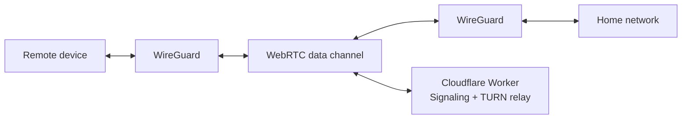

<p align="center">
  
</p>

# bamgate

A WireGuard VPN tunnel over WebRTC. Access your home network from anywhere without exposing your public IP or renting a VPS.

## How it works

bamgate connects two peers through a WireGuard tunnel, using WebRTC data channels as the transport layer. A Cloudflare Worker handles signaling and acts as a TURN relay fallback — all on the free tier.



- **Direct connection**: ICE/STUN punches through NAT when possible — low latency, no relay.
- **Relayed connection**: When direct fails (symmetric NAT), traffic routes through a TURN relay on Cloudflare Durable Objects. The relay only sees opaque encrypted blobs.

## Install

### Homebrew (macOS and Linux)

```bash
brew install bamgate/tap/bamgate
```

**Linux only:** Homebrew installs to a non-standard prefix that `sudo` can't find.
Create a symlink so `sudo bamgate` works:

```bash
sudo ln -sf $(which bamgate) /usr/local/bin/bamgate
```

This only needs to be done once and survives `brew upgrade`.

### Download binary

Pre-built binaries for Linux and macOS (amd64 + arm64) are available on the [releases page](https://github.com/bamgate/bamgate/releases).

### Build from source

```bash
go build -o bamgate ./cmd/bamgate
```

## Quick start

### First device (deploys the Cloudflare Worker)

```bash
sudo bamgate setup
```

This walks you through deploying the signaling server, generating WireGuard keys, and configuring the device. You'll need a [Cloudflare API token](https://dash.cloudflare.com/profile/api-tokens).

### Additional devices

On the first device, generate an invite code:

```bash
bamgate invite
```

On the new device, run setup with the invite code:

```bash
sudo bamgate setup
```

### Connect

On Linux, `setup` grants network capabilities so you can run without sudo:

```bash
bamgate up             # foreground
bamgate up -d          # daemon mode (systemd)
```

On macOS, root is always required:

```bash
sudo bamgate up
```

**Note:** After `brew upgrade bamgate`, re-run `sudo bamgate setup` to restore
network capabilities (Linux) or update the systemd service path.

Check status:

```bash
bamgate status
```

## Goals

- Zero exposed ports on the home network
- No VPS required — runs entirely on Cloudflare's free tier
- Single static binary for Linux and macOS
- WireGuard encryption end-to-end, with DTLS as an additional layer

## Documentation

- [Architecture](ARCHITECTURE.md) — full design document
- [LAN testing guide](docs/testing-lan.md) — step-by-step local testing

## License

[MIT](LICENSE)
